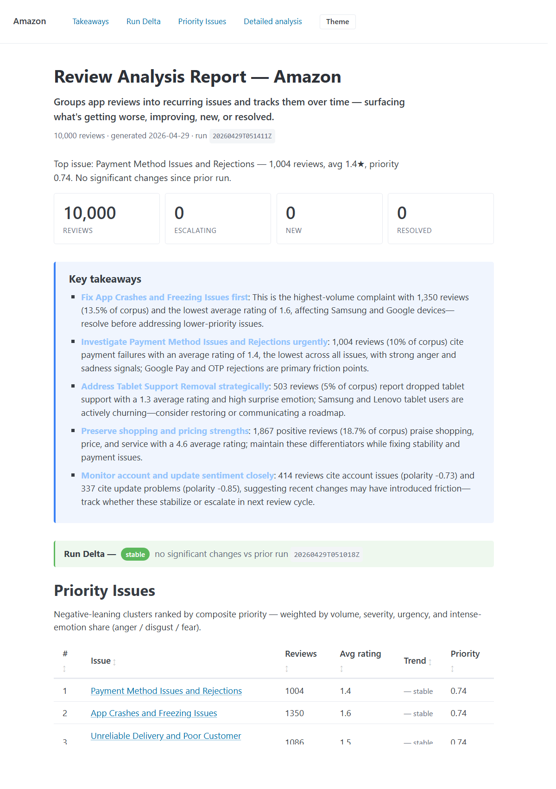

# Review Issue Tracker

App reviews tell you what's wrong with your product. Nobody reads 10,000 of them.

This pipeline groups recurring complaints into issues, scores their severity, and tracks how each one moves run over run. The result: at a glance, you see what's getting worse, what's improving, what's new, and what's resolved — without reading every review.

Each run produces two reports: a markdown file for grep / diff / pasting into chat, and a self-contained HTML file with interactive sparklines and sortable tables.

For a non-engineering overview of what the project does and what it found on Amazon, see [**SUMMARY.md**](SUMMARY.md). For a phase-by-phase retrospective of the engineering decisions and what I'd do differently, see [**DECISIONS.md**](DECISIONS.md).

---

## See the output

Sample reports for all three currently-supported apps live in [`reports/showcase/`](reports/showcase/) — open the `.html` file in any browser to see the interactive version, or read the `.md` if you'd rather grep the text.

| App | Reviews | Markdown | HTML |
|---|---:|---|---|
| Amazon | 10,000 | [Amazon.md](reports/showcase/Amazon.md) | [Amazon.html](reports/showcase/Amazon.html) |
| eBay | 10,000 | [eBay.md](reports/showcase/eBay.md) | [eBay.html](reports/showcase/eBay.html) |
| Walmart | 10,000 | [Walmart.md](reports/showcase/Walmart.md) | [Walmart.html](reports/showcase/Walmart.html) |

The Amazon report demonstrates the **Run Delta** layer comparing against a prior run; eBay and Walmart show the baseline-run rendering (no prior on file).

### Tour of a report

The above-the-fold of the Amazon HTML report:



1. **Elevator pitch** — what the pipeline does in one sentence, no jargon.
2. **Four-stat ribbon** — reviews · escalating · new · resolved.
3. **Run-summary narrative** — auto-generated single sentence describing the run's shape.
4. **Key Takeaways** — 3–5 LLM-synthesized actionable bullets that cite specific issues and numbers.
5. **Run Delta** — what changed since the prior run (escalating / improving / new / resolved buckets).
6. **Priority Issues leaderboard** — top negative clusters with ▲ / ▼ / ✦ / — trend arrows.

Below the fold, top-3 issue cards expand by default; the rest collapse behind a `<details>` toggle. The "Detailed analysis" divider signals the supporting evidence.

---

## Development history

The pipeline was built in ten phases. Earlier phases established the ingestion, feature, and clustering machinery; middle phases added the time dimension and presentation layer; later phases tightened the editorial story so a non-technical reader can act on the report in under a minute.

- **Phase I** — data ingestion: scraping → cleaning → storage → CSV export
- **Phase II** — feature engineering: raw review text → structured signals (sentiment, aspects, emotion, urgency, entities, embeddings, themes) → summary report
- **Phase III** — ABSA: per-aspect polarity via DeBERTa (replaces review-level polarity on aspects), new "Top Loved / Hated Features" report section
- **Phase IV** — time dimension: per-run cluster snapshots, cross-run issue matching, run-delta section (escalating / improving / new / resolved), intra-run mention sparklines, per-issue app-version slicing
- **Phase V** — LLM-generated cluster labels (4–6 word issue titles via Claude Haiku, content-addressed cache); thumbs-up-weighted representative review selection; expanded test coverage
- **Phase VI** — interactive single-file HTML report alongside the markdown one: Pico CSS + Chart.js inlined, sortable tables, live aspect filter, dark/light theme
- **Phase VII** — editorial pass: pitch tagline, auto-generated per-run narrative, four-stat ribbon (reviews · escalating · new · resolved), Run Delta promoted to the lead position, top-3 issue cards with the rest collapsed, supporting analysis demoted below a "Detailed analysis" divider
- **Phase VIII** — Key Takeaways: LLM-synthesized "so what?" layer on top of the report — 3–5 actionable bullets that cite specific issues and numbers, cached by content hash of the synthesis input
- **Phase IX** — detail-section cull: dropped Most Urgent Reviews, Emotion Distribution, Mentioned Entities, and Aspect Index (the four sections that were tables-without-insight); compacted Overall Sentiment from a six-card grid into a single "By the numbers" footer; added LLM narrative leads and question-shaped headings for the surviving Top Positives and ABSA sections
- **Phase X** — polish: render-time entity noise filter, word-boundary review truncation, compact green-tinted Run Delta empty state, ▲/▼/✦/— trend arrows on the Priority Issues leaderboard, theme-button visibility fix for Pico's button-scope variable shadowing

---

## Project Structure

```
data_ingestion/
├── scraper/
│   └── play_scraper.py        # Google Play scraper with pagination
├── database/
│   └── db.py                  # SQLite schema + dedup logic
├── pipeline/
│   ├── cleaner.py             # Normalize whitespace, dates, ratings
│   ├── feature_engineering.py # Sentiment, aspects, emotion, urgency, NER, embeddings, themes
│   ├── summarizer.py          # Report data extractor + markdown / HTML renderers
│   ├── issue_tracking.py      # Cross-run issue matching, sparklines (Phase IV)
│   ├── llm.py                 # LLM-generated cluster labels + key takeaways + section narratives (Phases V, VIII, IX)
│   ├── templates/             # HTML report assets (Phase VI)
│   │   ├── report.html.j2     #   Jinja2 template
│   │   └── assets/            #   Pico CSS + Chart.js, inlined at render time
│   ├── exporter.py            # CSV read/write
│   └── logger.py
├── tests/                     # 206-test pytest suite
├── logs/                      # Per-run execution logs (auto-generated)
├── exports/                   # Per-run CSV backups (auto-generated)
├── reports/                   # Per-run markdown + HTML summaries (auto-generated)
├── reviews.db                 # SQLite database (auto-generated)
├── feature_engineering_plan.md  # Design rationale for Phase II
├── main.py
├── requirements.txt
└── dev-requirements.txt       # pytest only — install for the test suite
```

---

## Setup

**Recommended:** Python 3.12 (3.9–3.13 also work). Avoid 3.14 — PyTorch CUDA wheels and `torch.jit.script` have known issues there.

```bash
python -m venv .venv
.venv\Scripts\Activate.ps1     # Windows PowerShell
# source .venv/bin/activate    # macOS / Linux

pip install -r requirements.txt
python -m spacy download en_core_web_sm
```

If you want to run the test suite, also install dev dependencies:
```bash
pip install -r dev-requirements.txt
```

### LLM cluster labels (optional, Phase V)

Issue cards default to keyword-style labels (`delivery, package, late`). To upgrade to LLM-generated titles (`Slow delivery and damaged packaging`), set an Anthropic key in your environment:

```powershell
# Windows PowerShell
$env:ANTHROPIC_API_KEY = "sk-ant-..."
```
```bash
# macOS / Linux
export ANTHROPIC_API_KEY="sk-ant-..."
```

Costs ~$0.005 per run on a 10k-review corpus. Labels are cached by cluster content, so re-runs on the same data make zero API calls. With no key set the pipeline falls back silently to aspect-string labels — never crashes.

On first run, HuggingFace will download two models: the emotion-classification model (~330 MB) and the DeBERTa ABSA model (~750 MB). Both are cached afterward.

### GPU (optional, big speedup)

If you have an NVIDIA GPU, the pipeline auto-detects CUDA and moves the embedder, emotion classifier, and ABSA classifier to it. Expected speedup on 10k reviews: end-to-end **~3 min on GPU vs ~30 min on CPU** (ABSA dominates the difference).

`pip install -r requirements.txt` pulls the **CPU** torch wheel by default (PyPI has no CUDA wheels for Windows). To switch to CUDA torch:

```bash
pip uninstall -y torch torchvision torchaudio
pip install torch --index-url https://download.pytorch.org/whl/cu121
```

Verify:
```bash
python -c "import torch; print(torch.cuda.is_available(), torch.version.cuda)"
# expected: True 12.1
```

When you run the pipeline you should see `[feature_engineering] device: cuda` on the first line.

To force CPU on a GPU machine (parity with a non-GPU teammate), set `FORCE_CPU=1` in the environment.

---

## Usage

### Full pipeline (scrape → features → report)
```bash
python main.py --apps amazon --count 10000 --export
```

### Multi-app
```bash
python main.py --apps amazon ebay walmart --count 10000 --export
```

### Iterate on feature engineering without re-scraping
Re-use a previously exported cleaned CSV to avoid hitting Google Play again:
```bash
python main.py --apps amazon --from-csv exports/amazon_20260422_023736.csv --export
```

### Arguments

| Argument | Default | Description |
|---|---|---|
| `--apps` | `amazon` | One or more app keys to process |
| `--count` | `10000` | Reviews to fetch per app (ignored with `--from-csv`) |
| `--export` | `False` | Write results to `exports/` |
| `--from-csv` | `None` | Load reviews from an existing cleaned CSV; skip scrape + DB |
| `--no-cache` | `False` | Skip the feature cache; recompute every feature from scratch |
| `--n-clusters` | `None` | Force a fixed number of clusters; default is adaptive K via silhouette score |

### Supported Apps

| Key | App | Package ID |
|---|---|---|
| `amazon` | Amazon Shopping | `com.amazon.mShop.android.shopping` |
| `ebay` | eBay | `com.ebay.mobile` |
| `walmart` | Walmart | `com.walmart.android` |

Add a new app by editing the `APPS` dict in [main.py](main.py).

---

## Pipeline Overview

```
Scrape ─► Clean ─► Store ─► Feature Engineering ─► Summary Report
                     │                                   │
                     ▼                                   ▼
                  SQLite                         reports/{app}_{ts}.md
                                                 exports/{app}_features_{ts}.csv
```

Each app runs independently. Reviews are deduped by Google Play `review_id` with an MD5 hash fallback, so re-running the pipeline adds only new reviews to the database.

---

## Phase II — Feature Engineering

For every review the pipeline produces:

| Feature | Type | Tool | Purpose |
|---|---|---|---|
| `polarity` | float [-1, 1] | TextBlob | How positive/negative (review-level) |
| `subjectivity` | float [0, 1] | TextBlob | Fact-based vs opinion-based |
| `aspects` | list[{aspect, polarity, confidence}] | spaCy + DeBERTa ABSA | Per-aspect sentiment — each noun-chunk scored independently |
| `entities` | list[{text, label}] | spaCy NER | ORG / PRODUCT mentions (competitors, platforms) |
| `emotion` | str | DistilRoBERTa | anger / disgust / fear / joy / neutral / sadness / surprise |
| `urgency` | float [0, 1] | heuristic | Actionability score (bug keywords + low rating + low subjectivity + aspect specificity) |
| `embedding` | list[float, 768] | sentence-transformers (all-mpnet-base-v2) | Semantic vector |
| `theme_cluster` | int | KMeans over embeddings (adaptive K + post-hoc merge) | Auto-discovered theme label |

Design rationale and validation criteria are documented in [feature_engineering_plan.md](feature_engineering_plan.md).

### Clustering

Cluster count is chosen automatically per run by sweeping K ∈ [4, 15] and picking the value with the highest silhouette score (sampled at 2,000 points for speed on large corpora). Pass `--n-clusters N` to force a fixed K.

After KMeans, near-duplicate clusters are collapsed with a single union-find pass: any two clusters whose top-8 aspect sets overlap above 0.5 (overlap coefficient) merge into one. This catches the "same issue split across two clusters" failure mode that fixed-K clustering tends to produce. Surviving clusters are renumbered to a contiguous `0..N-1` range.

### Summary Report

Every run writes a markdown report to `reports/{app}_{timestamp}.md` and a self-contained HTML report next to it. The report is organized top-down by reader-effort: the most synthesized layers come first, with the supporting evidence below a "Detailed analysis" divider.

**Above the fold**

- **Header** — app name, run id, elevator-pitch tagline ("Groups app reviews into recurring issues and tracks them over time…")
- **Four-stat ribbon** — reviews · escalating · new · resolved (Phase VII)
- **Run summary narrative** — one auto-generated sentence describing the run's shape (e.g. "Two issues escalating, one improving, one new since the last run.") (Phase VII)
- **Key Takeaways** — 3–5 LLM-synthesized executive bullets that cite specific issues and numbers (Phase VIII). Returns the "so what?" the rest of the report supports. Cached by content hash; missing API key → section omitted, never crashes.
- **Run Delta** — what changed since the prior run for this app: escalating (>20% increase), improving (>20% decrease), new (no prior match), resolved (prior issue with no current match). On the baseline run, renders a compact green-tinted "no prior run on file" line. (Phases IV / X)
- **Priority Issues leaderboard** — top negative clusters ranked by a composite score (volume × severity × urgency × intense-emotion share). Each row carries a ▲/▼/✦/— trend arrow tagged from Run Delta. (Phase X)

**Top issue cards** (top 3 expanded, the rest collapsed)

Each card has:
- LLM-generated title (e.g. "Slow delivery and damaged packaging") + the keyword-style aspect string as a subtitle
- Big-number stats (review count, severity, urgency) and a Chart.js (HTML) / ASCII (markdown) mention sparkline
- Bug-vs-complaint split (objective vs subjective subset, with each side's top aspects)
- Top app versions where the issue surfaces (Phase IV)
- Representative reviews (closest to centroid, thumbs-up weighted, word-boundary truncated)

**Below "Detailed analysis"**

- **What are users happy about?** — top positive clusters, with a one-sentence LLM narrative lead (Phase IX)
- **Which features are loved vs hated?** — top loved and top hated features by per-aspect DeBERTa polarity, ranked by avg polarity × log(mentions); also led by an LLM narrative sentence (Phase IX)
- **By the numbers** footer — single-line dense stats: review count, avg rating, avg polarity, % positive / negative / neutral, objective vs subjective negative split (Phase IX, replaces the old six-card Overall Sentiment grid)

The four old detail sections — Most Urgent Reviews, Emotion Distribution, Mentioned Entities, and Aspect Index — were dropped in Phase IX. The signal they carried was already surfaced in the issue cards (urgency feeds the priority score; emotion / entities show up per-card; aspects are the cluster labels themselves). They became data-without-insight noise once the layers above them earned their place.

### Extending the Feature Set

The pipeline is organized so new features plug in without touching existing ones:

1. Add a new feature function in [pipeline/feature_engineering.py](pipeline/feature_engineering.py) that reads `review["body"]` (or other existing fields) and returns a dict of new keys.
2. Call it in `run_pipeline()` at the appropriate step.
3. Optionally add a new section to [pipeline/summarizer.py](pipeline/summarizer.py) that reads those new keys and register it in `generate_report()`.

---

## Phase IV — Time Dimension

Phase IV adds cross-run continuity. Each pipeline run persists a snapshot of every cluster (aspects, centroid, counts, severity) keyed by `app_slug` and a per-run ISO timestamp. The next run loads the most recent prior snapshot for that app and matches each current cluster to the cluster it continues — turning the report from a one-shot snapshot into a monitoring tool.

### Cross-run issue matching

For each current cluster, the matcher tries two signals in order ([pipeline/issue_tracking.py](pipeline/issue_tracking.py)):

1. **Aspect Jaccard** — `|A ∩ B| / |A ∪ B|` over the cluster's top distinctive aspects. Threshold `≥ 0.4`. Robust to small wording shifts and naturally handles cluster growth/shrinkage.
2. **Centroid cosine** — fallback when Jaccard is below threshold. Cosine similarity between the current and prior cluster embedding centroids. Threshold `≥ 0.7`. Catches "same theme, different vocabulary" cases where the aspect words drifted but the semantic core didn't.

Many-to-one matches are allowed (a cluster split — two current issues both pointing at the same prior).

### Run Delta section

Compares current to prior and bins every cluster into one of four buckets:

- **Escalating** — `current_count / prior_count > 1.2`
- **Improving** — `current_count / prior_count < 0.8`
- **New** — no prior match, `current_count ≥ 20`
- **Resolved** — prior cluster with no current match, `prior_count ≥ 20`

Tiny-cluster churn (< 20 reviews) is suppressed since KMeans label assignments shuffle between runs.

### Sparklines and version slicing

Two additions inside each top-issue card:

- **Trend sparkline** — the cluster's `review_date` values bucketed into 12 equal-time slots, rendered as `▁▂▃▄▅▆▇█`. Skipped when the cluster spans less than two distinct days (a single bar isn't informative).
- **By app version** — top 5 `app_version` values by count of reviews mentioning this issue. Surfaces "issue X spiked at v17.4" patterns. Silently absent when no review in the cluster has an `app_version` (e.g. CSVs exported before the Phase IV cleaner fix).

### When does Run Delta render?

- **First run for an app slug** → `_No prior run on file for this app — this is the baseline._`
- **Subsequent run** → comparison against the most recent prior run (strictly earlier `run_id`).
- **No app_slug passed** (e.g. ad-hoc test invocations) → section is omitted entirely.

---

## Phase V — LLM Cluster Labels & Polish

Phase V replaces the keyword-soup cluster labels (`delivery, package, late`) with concise LLM-generated titles (`Slow delivery and damaged packaging`) for each priority issue. The title shows up as the issue card heading; the original aspect string drops to a subtitle so keyword-grep still works.

### Provider seam

[pipeline/llm.py](pipeline/llm.py) is a single-function seam (`generate_cluster_label`) that talks to Anthropic by default (`claude-haiku-4-5`). To swap providers, only `_call_llm` needs to change. DeepSeek's Anthropic-format endpoint is a one-line config swap (just override `base_url`).

### Caching

Labels are content-addressed by `md5(sorted(review_hashes) + sorted(aspect_set))` and stored in the `issue_labels` table. Same cluster contents → same cache key → no extra API call on a re-run. ~5–8 calls per run on a fresh dataset, ~$0.005 total. Re-runs on the same data are free.

### Failure semantics

The pipeline never crashes on LLM failure. Missing `ANTHROPIC_API_KEY`, network errors, or empty responses all degrade silently to the existing aspect-string label. A WARNING is logged for the run log but the report itself stays clean.

```bash
# Set this once per shell to enable LLM titles
$env:ANTHROPIC_API_KEY = "sk-ant-..."
```

### Other Phase V improvements

- **Thumbs-up-weighted representative reviews.** `_representative_reviews` now picks within a closeness-based candidate pool, then sorts by `thumbs_up` DESC inside the pool. Falls back to pure closeness when all reviews have `thumbs_up=0` (older CSVs from before the cleaner fix).
- **NER stopwords** extended to filter `OTP`, `Newest`, `Tablet`, `Tablets` — corpus-domain words spaCy was mistagging as ORG entities.
- **`tqdm` progress bar** on `absa_features` for CPU users (where ABSA dominates the ~25-min run time).
- **Test coverage** went from 26 → 206 across `cleaner`, `issue_tracking`, `snapshots`, `llm`, `summarizer`, `feature_engineering`, and `report_data` (the count grew with each later phase as new cache tables and renderer paths were added).

---

## Phase VI — HTML Report

Every run also writes an interactive single-file HTML report next to the markdown one — `reports/{app}_{run_id}.html`. Self-contained at ~300KB (Pico CSS and Chart.js are inlined), so you can drop the file into Slack / email / Notion and it works offline.

### Architecture

`build_report_data()` returns a single nested dict that is the source of truth for both renderers:

```
build_report_data(reviews, app_name, app_slug)
        │
        ├── data dict (header, overall, issues, run_delta, absa, …)
        │
        ├── render_markdown(data) → MD string
        └── render_html(data)     → HTML string (None if jinja2 / assets missing)
```

The original `_xxx_section()` markdown formatters survive as thin back-compat wrappers; new code consumes the data dict directly.

### Interactive features

- **Sticky top nav** with anchor links to each section
- **Sortable tables** (Priority Issues / Top Positives / Loved & Hated Features) — click any column header
- **Real Chart.js sparklines** inside each issue card with hover tooltips that report the date bucket and mention count (replaces the ASCII bars from the markdown report)
- **Stacked bars** for sentiment distribution and per-issue bug/complaint split
- **▲ / ▼ / ✦ / —** trend arrows on the Priority Issues leaderboard, tagged from Run Delta (Phase X)
- **Pills** for emotions, entities, and app versions inside issue cards
- **Dark / light theme toggle** with a visible nav button on both themes (Pico's button-scope variable is escaped via `color: inherit`); choice persisted via `localStorage`

### Self-containment

CSS and JS are read from `pipeline/templates/assets/` at render time and inlined into every output file. If the template or assets are missing, `render_html` returns `None` and only the markdown is written — the HTML report is treated as polish, never required.

---

## Phase VII — Editorial Pass

Phase VII reorganized the report around reader effort rather than data hierarchy. The diagnosis from the v1 read-through: the report dumped data in dependency order (sentiment → clusters → deltas → tail tables), so a non-technical reader had to read top-to-bottom to extract a single takeaway.

The fix was structural, not stylistic:

- **Elevator-pitch tagline** under the H1 (single sentence, no jargon, no techniques) — `ELEVATOR_PITCH` constant in [pipeline/summarizer.py](pipeline/summarizer.py).
- **Four-stat ribbon** (reviews · escalating · new · resolved) immediately below the tagline — answers "what happened this run?" in four numbers.
- **Auto-generated run-summary narrative** — single sentence picking from four cases (escalations dominate / improvements dominate / mixed / quiet run). Written templatically, not LLM-generated, so it always renders.
- **Run Delta promoted** to the top of the body, ahead of Priority Issues — the "what changed" answer is more time-sensitive than the leaderboard.
- **Top 3 issue cards expanded, the rest collapsed** behind a `<details>` element — caps the above-the-fold body at a scannable height.
- **"Detailed analysis" divider** demoting supporting sections — signals to the reader they can stop here if the above answered their question.

---

## Phase VIII — Key Takeaways

Phase VIII added the layer the v2 read-through revealed was still missing: a 3–5 bullet executive summary that synthesizes what the rest of the report *means*, not just what it shows.

### What the section produces

LLM-generated bullets that cite specific issues and numbers from the data, e.g.

> - **Slow delivery** is the run's top priority issue (412 reviews, escalating 38% since the last run) — investigate carrier handoff at v17.4.
> - Search relevance has improved 22% but is still the #2 negative cluster — keep watching.

Each bullet supports `**markdown bold**` for emphasis. The HTML renderer converts via a small Jinja filter; the markdown renderer passes through unchanged.

### Architecture

`generate_key_takeaways(report_data)` in [pipeline/llm.py](pipeline/llm.py) pulls a synthesis input from the assembled data dict (top issues, run delta buckets, top loved/hated features, top positives) and asks Claude Haiku for the bullets. The function:

- **Caches by content hash** — `md5(synthesis_input_json)` → `takeaways_cache` table → no API call on a re-run with the same data.
- **Degrades silently** — missing API key, network error, empty response, or no parseable bullets → returns `None` and the section is omitted from the report. Never crashes the run.
- **Caps tokens** to keep cost predictable — adds ~$0.002 per fresh run, free on cache hit.

---

## Phase IX — Detail-Section Cull & Section Narratives

Phase IX cut every detail section that was a table without an insight, and added LLM narrative leads to the survivors.

### Sections removed

- **Most Urgent Reviews** — urgency already feeds the priority score, so the same reviews surface inside the top issue cards.
- **Emotion Distribution** — global counts didn't tell you what to do; per-issue emotion pills already carry the actionable view.
- **Mentioned Entities** — a flat brand list without context. Per-issue entity pills retain the useful framing.
- **Aspect Index** — a drill-down lookup that nobody used because the issue cards already carry the aspects they own.

### Sections kept and re-framed

The two surviving detail sections (Top Positives, ABSA loved/hated) now have:

- **Question-shaped headings** — "What are users happy about?" and "Which features are loved vs hated?" instead of category labels. Tells the reader why they'd read the section.
- **LLM narrative leads** — one sentence calling out the single most notable specific entry with its supporting number, generated by `generate_section_narrative(section_name, section_data)` in [pipeline/llm.py](pipeline/llm.py).

Section narratives use the same caching and silent-fallback pattern as Key Takeaways. Cache key includes the section name to avoid cross-section collisions.

### Compaction of Overall Sentiment

The six-card grid (avg rating / avg polarity / % pos / % neg / obj-neg / subj-neg) collapsed into a single dense **"By the numbers"** footer line at the bottom of the report — the run's stats are now context, not headlines.

---

## Phase X — Polish

Phase X is the small-edit pass that came out of the third read-through. None of these are structural; together they remove the last ~10% of "this is a draft" feel.

- **Render-time entity noise filter** — `RENDER_ENTITY_NOISE` set in [pipeline/summarizer.py](pipeline/summarizer.py) drops corpus-domain words that spaCy's NER mistags as ORG/PRODUCT (`Rufus`, `Alexa`, `Customer Service`, `Newest`, `Tablet`, `Android`, `iOS`, etc.). Filtered at render time, not at extraction, so the cached features stay intact — bumping `FEATURE_SCHEMA_VERSION` just to drop these wasn't worth a full ABSA recompute.
- **Word-boundary review truncation** — `_truncate_at_word(text, max_len)` cuts representative reviews at the last word before the budget and adds an ellipsis, instead of slicing mid-word. Budget reserves space for the ellipsis so the output never exceeds `max_len`.
- **Compact stable Run Delta state** — when no buckets have entries, the section renders as a single green-tinted line ("No qualifying movement since the last run.") instead of four empty bucket headers. The full section returns whenever there's anything to report.
- **Trend arrows on the leaderboard** — `_attach_trends_to_issues(data)` tags each top issue with an `escalating` / `improving` / `new` / `stable` classification from the Run Delta buckets. The leaderboard renders ▲ / ▼ / ✦ / — accordingly so a glance at the table tells you which issues are moving.
- **Theme button visibility fix** — Pico CSS redefines `--pico-color` inside its own button scope to `--pico-primary-inverse` (white-on-white in light mode). The fix uses `color: inherit` on the toggle button to escape the button-scope variable, plus `border-color: currentColor` on hover.
- **Vocabulary cleanup** — issue card subheadings dropped, metrics compacted into a single footer, pills repalette'd to an explicit blue with dark-mode adaptation.

---

## Database Schema

### `companies`

| Column | Type | Description |
|---|---|---|
| id | INTEGER | Primary key |
| name | TEXT | App display name |
| slug | TEXT UNIQUE | Google Play package ID |
| created_at | TEXT | Timestamp |

### `reviews`

| Column | Type | Description |
|---|---|---|
| id | INTEGER | Primary key |
| company_id | INTEGER | FK → companies.id |
| review_id | TEXT UNIQUE | Google Play review ID |
| reviewer_name | TEXT | Name of the reviewer |
| rating | INTEGER | Star rating (1–5) |
| title | TEXT | Review title |
| body | TEXT | Review body text |
| review_date | TEXT | YYYY-MM-DD |
| thumbs_up | INTEGER | Helpful-vote count |
| app_version | TEXT | App version reviewed on |
| scraped_at | TEXT | Timestamp record was scraped |
| review_hash | TEXT UNIQUE | MD5 hash (dedup fallback) |

### `features`

Per-review feature cache. Content-addressed by `review_hash` (the same MD5 used for review dedup), so caching works in both DB and `--from-csv` modes. There is no foreign key to `reviews` — the cache survives even when the source row isn't in the reviews table.

| Column | Type | Description |
|---|---|---|
| review_hash | TEXT PRIMARY KEY | MD5 of (reviewer_name, date, body) |
| schema_version | INTEGER | Feature schema version; mismatched rows are misses |
| embedder_model | TEXT | Embedder model name; guards against silent cache poisoning |
| polarity | REAL | TextBlob polarity |
| subjectivity | REAL | TextBlob subjectivity |
| aspects | TEXT | JSON list[{aspect, polarity, confidence}] |
| entities | TEXT | JSON list[{text, label}] |
| emotion | TEXT | DistilRoBERTa emotion label |
| urgency | REAL | Heuristic urgency score |
| embedding | BLOB | numpy float32 bytes |
| embedding_dim | INTEGER | Vector dimension (sanity check on decode) |
| created_at | TEXT | Timestamp the row was written |

`theme_cluster` is **not** cached: cluster IDs aren't stable across runs (KMeans labels are arbitrary), so clustering re-runs every time on the embedding matrix. Embeddings load instantly from cache, so re-clustering is the only model-level work on a fully-warm cache run.

#### When does the cache miss?

A row is treated as a miss (and recomputed) when:
- It doesn't exist
- Its `schema_version` differs from `FEATURE_SCHEMA_VERSION` in [pipeline/feature_engineering.py](pipeline/feature_engineering.py)
- Its `embedder_model` differs from the currently configured embedder

Bump `FEATURE_SCHEMA_VERSION` whenever feature semantics change (model swap, new filter, new field). To force a full recompute without a version bump, pass `--no-cache`.

Current version: **3** (ABSA per-aspect polarity added in Phase III).

### `issue_snapshots`

Per-run cluster snapshots written by the summarizer when an `app_slug` is supplied. One row per cluster (issues *and* non-issues both — the delta view needs the full distribution to detect new/resolved clusters). Keyed by `app_slug` rather than `company_id` so snapshotting works in `--from-csv` mode without requiring a `companies` row.

| Column | Type | Description |
|---|---|---|
| id | INTEGER | Primary key |
| app_slug | TEXT | App identifier (Google Play package ID) |
| run_id | TEXT | ISO timestamp, one per pipeline run |
| cluster_id | INTEGER | Contiguous cluster id within this run (post-merge) |
| cluster_label | TEXT | Joined distinctive aspects (e.g. "delivery, package, driver") |
| aspect_set | TEXT | JSON list[str] of top-K distinctive aspects (used for Jaccard match) |
| centroid | BLOB | Mean embedding of the cluster, float32 bytes (used for cosine fallback) |
| centroid_dim | INTEGER | Vector dimension |
| review_count | INTEGER | Number of reviews in the cluster |
| avg_rating | REAL | Mean star rating |
| avg_polarity | REAL | Mean review-level polarity |
| avg_urgency | REAL | Mean urgency score |
| priority_score | REAL | Composite priority (NULL for non-issue clusters) |
| is_issue | INTEGER | 1 if cluster qualified as a priority issue, 0 otherwise |
| created_at | TEXT | Timestamp the row was written |

A re-save with the same `(app_slug, run_id)` first deletes the prior rows for that run — re-running the pipeline against the same data won't double-count.

### `issue_labels`

LLM-generated cluster labels (Phase V). Cache key is `md5(sorted(review_hashes) + sorted(aspect_set))` so identical cluster contents reuse the same label across apps and runs.

| Column | Type | Description |
|---|---|---|
| cache_key | TEXT PRIMARY KEY | Content hash of cluster review hashes + aspect set |
| label | TEXT | The 4–6 word LLM-generated title |
| model | TEXT | Model name that produced the label (e.g. `claude-haiku-4-5`) |
| created_at | TEXT | Timestamp the row was written |

### `takeaways_cache`

LLM-synthesized executive bullets (Phase VIII). Keyed by a content hash of the synthesis input (top issues + run delta + ABSA highlights + positives + entities). Stored as raw markdown so renderers can adapt: HTML uses a small filter to convert `**bold**`, markdown emits as-is.

| Column | Type | Description |
|---|---|---|
| cache_key | TEXT PRIMARY KEY | Content hash of the synthesis input |
| content | TEXT | Raw markdown bullets from the LLM |
| model | TEXT | Model name that produced the bullets |
| created_at | TEXT | Timestamp the row was written |

### `section_narratives_cache`

Per-section narrative leads (Phase IX) for the surviving Detailed Analysis sub-sections (Top Positives, ABSA). Same shape as `takeaways_cache`; kept as a separate table for clarity and to avoid eviction collisions. Cache key includes the section name to prevent cross-section reuse.

| Column | Type | Description |
|---|---|---|
| cache_key | TEXT PRIMARY KEY | `md5(section_name + canonical_section_data_json)` |
| content | TEXT | The 1–2 sentence narrative (may contain `**bold**`) |
| model | TEXT | Model name that produced the narrative |
| created_at | TEXT | Timestamp the row was written |

All three LLM cache tables are loaded with defensive `try / except sqlite3.OperationalError` so older `reviews.db` files that predate a given table treat the lookup as a cache miss instead of crashing — forward-compatible with users who pulled the code mid-phase.

---

## Output Files

| File | Location | Description |
|---|---|---|
| Database | `reviews.db` | SQLite: scraped reviews + feature cache + per-run cluster snapshots + LLM caches (cluster labels, key takeaways, section narratives) |
| Raw CSV | `exports/{app}_{ts}.csv` | Cleaned reviews (compatible with `--from-csv`) |
| Features CSV | `exports/{app}_features_{ts}.csv` | Reviews + all feature columns except the 768-dim embedding |
| Markdown report | `reports/{app}_{run_id}.md` | Plain-text analytical report — good for grep / diff / pasting into chat |
| HTML report | `reports/{app}_{run_id}.html` | Interactive single-file report with sortable tables + Chart.js sparklines (Phase VI) |
| Run log | `logs/pipeline_{ts}.log` | Per-run execution log |

---

## Dependencies

```
requests
beautifulsoup4
google-play-scraper
textblob
spacy
sentence-transformers
transformers<4.50      # see note in requirements.txt about CVE-2025-32434
sentencepiece          # DeBERTa-v3 tokenizer
protobuf               # paired with sentencepiece for spm conversion
scikit-learn
numpy
anthropic              # LLM cluster labels (Phase V)
jinja2                 # HTML report templating (Phase VI)
```

Plus the spaCy English model: `python -m spacy download en_core_web_sm`.

`tqdm` rides in transitively (used for the ABSA progress bar on CPU runs). `pytest` lives in `dev-requirements.txt` so production installs stay lean.

**Optional CUDA torch** for GPU inference — see the [GPU section](#gpu-optional-big-speedup) above.
